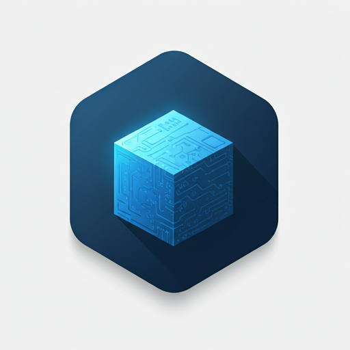
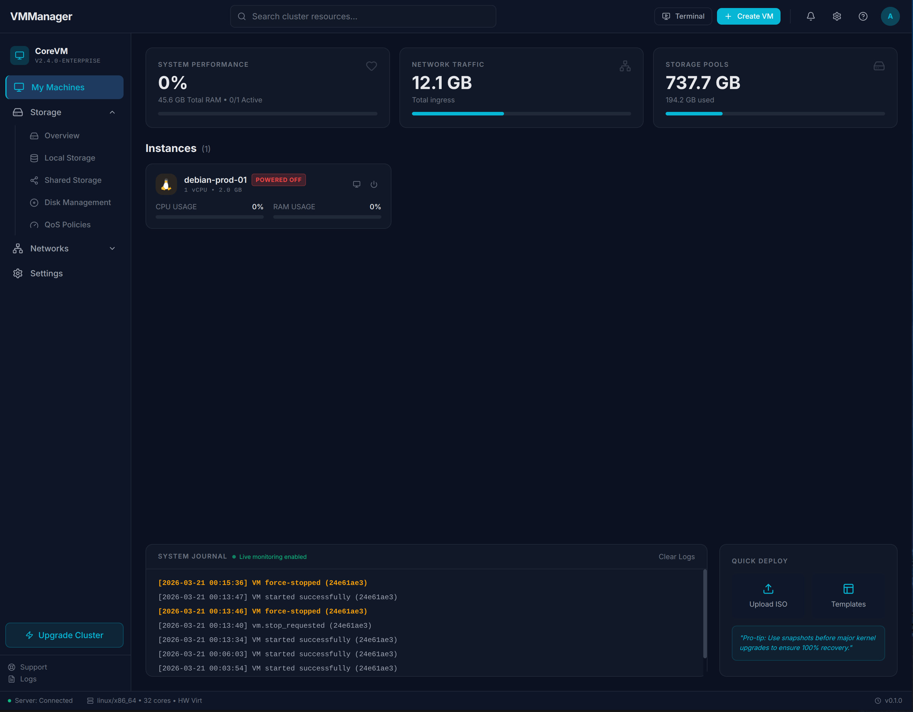
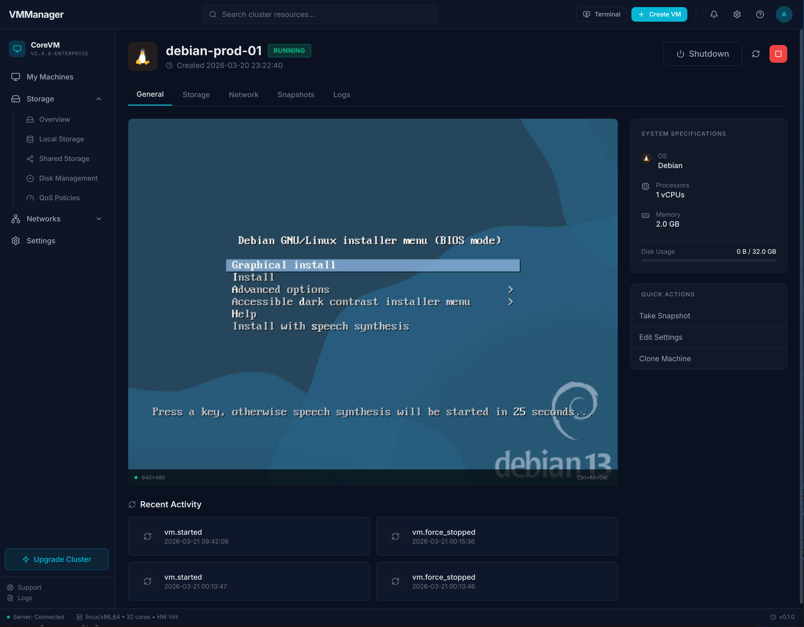
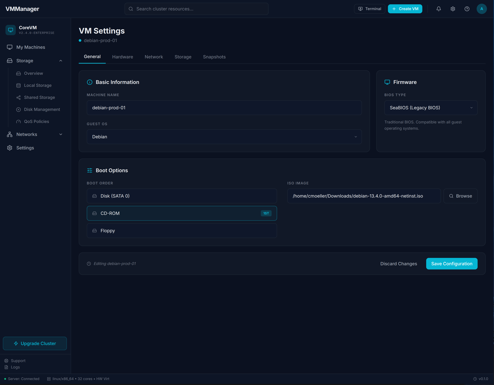
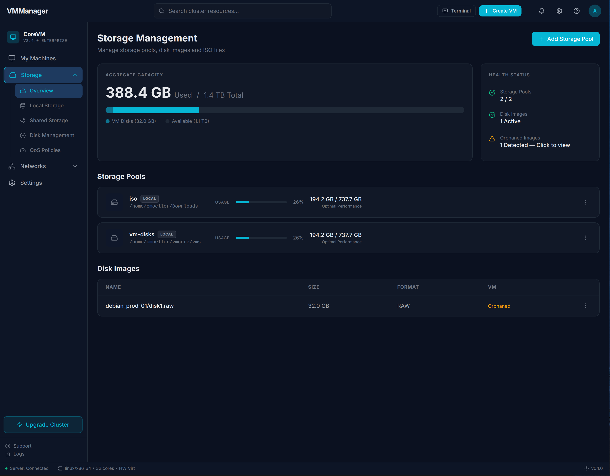
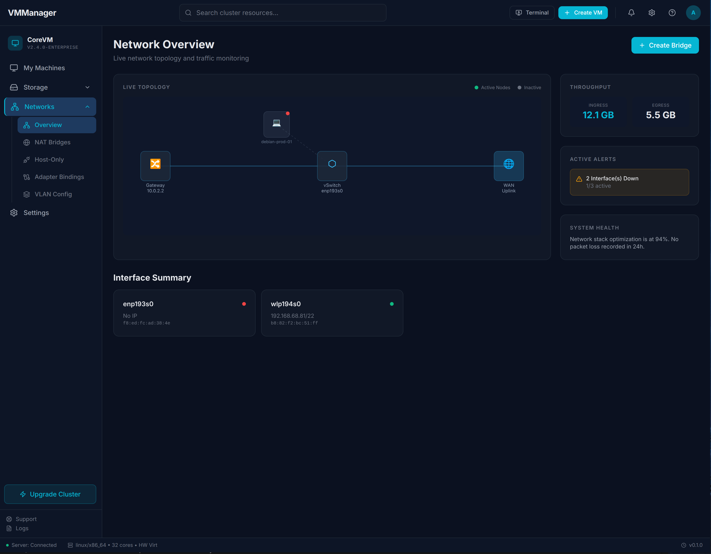
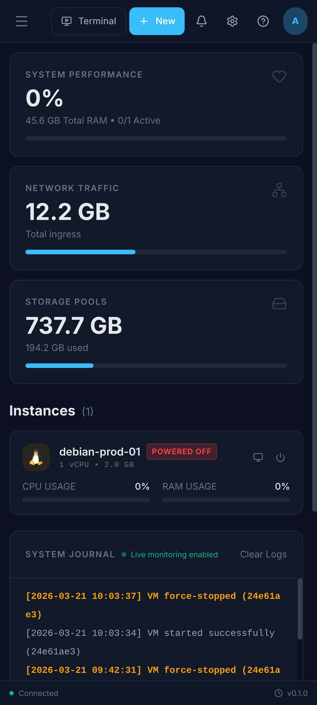
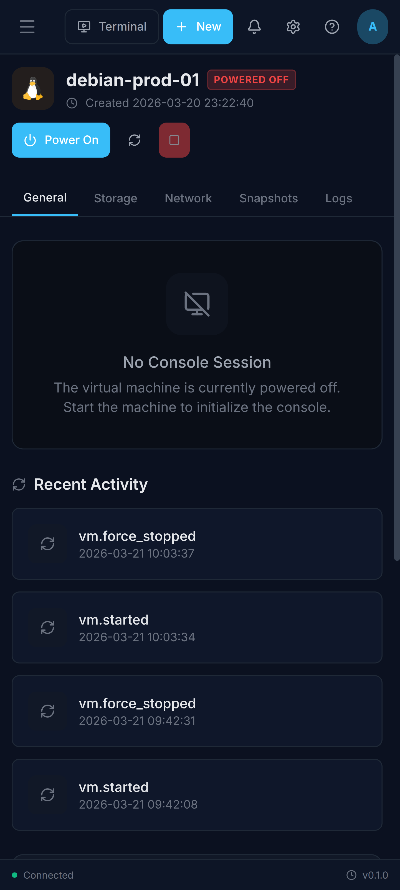

<div align="center">



<br><br>

# CoreVM

**A pure-software x86 virtual machine engine built entirely in Rust and NASM assembly,**
**with a modern web-based management platform and cluster orchestration.**

Full PC hardware emulation with KVM acceleration — create, manage, and run real
operating systems without depending on QEMU or any external emulator.
Single-node or multi-node cluster deployments with DRS, HA, and live migration.

<br>


<br>

[Features](#features) · [VMM Web UI](#vmm-web-ui) · [Quick Start](#quick-start) · [Architecture](#architecture) · [REST API](#rest-api) · [Building](#building) · [Cluster](#cluster-orchestration) · [Docs](docs/) · [anyOS Integration](#anyos-integration)

</div>

<br>

> **CoreVM** is the virtual machine engine behind [anyOS](https://github.com/nicosommelier/anyos). It runs as a standalone Linux/Windows application with hardware acceleration (KVM / Hyper-V) and also compiles as a `no_std` library for embedded use inside the anyOS kernel — where hardware virtualization is provided by the anyOS VMd, leveraging VT-x and AMD-V directly.

---

## VMM Web UI

CoreVM ships with **vmm-server**, **vmm-cluster**, and **vmm-ui** — a full-featured, web-based management platform for virtual machines with optional multi-node cluster orchestration. Fully responsive — manage your VMs from desktop or phone.

> Click any screenshot to view full size.

### Desktop

<p align="center">
  <a href="assets/screenshots/dashboard.png"></a>&nbsp;
  <a href="assets/screenshots/vm.png"></a>&nbsp;
  <a href="assets/screenshots/vmsettings.png"></a>
</p>
<p align="center">
  <sub>Dashboard</sub>&emsp;&emsp;&emsp;&emsp;&emsp;&emsp;&emsp;&emsp;&emsp;&emsp;&emsp;&emsp;&emsp;
  <sub>Virtual Machines</sub>&emsp;&emsp;&emsp;&emsp;&emsp;&emsp;&emsp;&emsp;&emsp;&emsp;&emsp;&emsp;
  <sub>VM Settings</sub>
</p>

<p align="center">
  <a href="assets/screenshots/storage.png"></a>&nbsp;
  <a href="assets/screenshots/network.png"></a>
</p>
<p align="center">
  <sub>Storage Management</sub>&emsp;&emsp;&emsp;&emsp;&emsp;&emsp;&emsp;&emsp;&emsp;&emsp;&emsp;
  <sub>Network Management</sub>
</p>

### Mobile

<p align="center">
  <a href="assets/screenshots/mobile_vms.png"></a>&emsp;
  <a href="assets/screenshots/mobile_details.png"></a>&emsp;
  <a href="assets/screenshots/mobile_console.png"></a>
</p>
<p align="center">
  <sub>VM List</sub>&emsp;&emsp;&emsp;&emsp;&emsp;&emsp;&emsp;&emsp;&emsp;&emsp;&emsp;&emsp;
  <sub>VM Details</sub>&emsp;&emsp;&emsp;&emsp;&emsp;&emsp;&emsp;&emsp;&emsp;&emsp;&emsp;
  <sub>Live Console</sub>
</p>

---

## Features

### Web Management Platform (vmm-server + vmm-ui)

- **Dashboard** — real-time system metrics, VM overview, storage/network stats, audit trail
- **VM Lifecycle** — create, start, stop, force-stop, delete VMs via REST API or Web UI
- **Live Console** — VGA framebuffer streaming over WebSocket with keyboard & mouse input
- **Storage Management** — storage pools, disk image creation/resize, ISO upload & management
- **Network Management** — interface overview, NAT configuration, traffic statistics
- **User Management** — JWT authentication, role-based access (admin/user), user & group management
- **Settings** — server configuration, timezone, security policies, UI preferences
- **Audit Logging** — full activity trail for all management operations
- **Built with** — Rust (Axum + Tokio), React 19, TypeScript, Tailwind CSS, SQLite

### Cluster Orchestration (vmm-cluster)

- **Multi-Node Management** — central authority managing multiple vmm-server nodes
- **DRS (Distributed Resource Scheduler)** — automatic VM load balancing with per-VM/group exclusions
- **High Availability** — automatic VM failover when nodes go offline, with state reconciliation
- **Direct Host-to-Host Migration** — disk transfer directly between nodes with one-time tokens
- **Host Maintenance Mode** — safely drain VMs before host maintenance
- **SDN (Software-Defined Networking)** — cluster-wide virtual networks with integrated DHCP, DNS, and PXE
- **Storage Wizard** — guided setup for NFS, GlusterFS, and CephFS cluster filesystems
- **Notifications** — email, webhook, and log channels with configurable rules and cooldowns
- **LDAP / Active Directory** — external authentication with group-to-role mapping
- **Managed Mode Enforcement** — blocks direct API access on managed nodes, redirects to cluster
- **State Reconciler** — prevents split-brain after node reconnect
- **Events & Alarms** — cluster event logging and alert system
- **Task Tracking** — monitor long-running operations (migrations, provisioning)

### CPU & Execution

- **Full x86 ISA** — 16-bit real mode, 32-bit protected mode, 64-bit long mode
- **Paging** — 2-level (32-bit), PAE (3-level), 4-level (long mode) page table walks with NX, WP, U/S enforcement
- **Multi-backend** — KVM (Linux), Hyper-V/WHP (Windows), anyOS VMd (bare-metal)

### PC Hardware Emulation

CoreVM emulates a complete IBM PC-compatible system with 25+ devices:

| Device | Description |
|--------|-------------|
| **Intel E1000** | Gigabit Ethernet NIC (82540EM) — MMIO, DMA, MSI, PXE boot ROM |
| **AHCI** | SATA controller (ICH9) — DMA, NCQ, multiple ports |
| **IDE/ATA** | Legacy ATA disk controller — PIO and DMA modes |
| **AC'97** | Audio codec (ICH, 8086:2415) — PCM playback |
| **VMware SVGA II** | GPU with 2D acceleration, hardware cursor |
| **VGA/Bochs VBE** | Standard VGA + VESA BIOS Extensions framebuffer |
| **Dual 8259A PIC** | Programmable Interrupt Controller (master + slave) |
| **8254 PIT** | Programmable Interval Timer (3 channels) |
| **HPET** | High Precision Event Timer |
| **Local APIC** | Advanced Programmable Interrupt Controller |
| **I/O APIC** | Interrupt routing (82093AA) |
| **PS/2** | Keyboard and mouse controller |
| **CMOS/RTC** | Real-time clock with NVRAM |
| **16550 UART** | Serial ports (COM1–COM4) |
| **PCI Bus** | PCI configuration space with PCIe MMCFG support |
| **ACPI** | Power management (DSDT, FADT, MADT, MCFG tables) |
| **Q35 MCH** | Q35 chipset memory controller hub |
| **fw_cfg** | QEMU firmware configuration interface |
| **APM** | Advanced Power Management (shutdown/reboot) |

### Networking

- **User-mode NAT (SLIRP)** — built-in NAT + DHCP + DNS, no root or TAP required
  - Virtual 10.0.2.0/24 network with gateway, DHCP, and DNS relay
  - TCP connection tracking with flow control, retransmit, and window scaling
  - UDP forwarding with automatic flow expiration
  - ICMP echo reply

### BIOS

- **Custom 64 KB NASM BIOS** with complete interrupt services (INT 10h, 13h, 15h, 16h, 19h, 1Ah)
- **SeaBIOS support** — standard firmware for maximum compatibility
- **PCI BIOS** — BAR enumeration, interrupt routing
- **Boot methods** — HDD (MBR), CD-ROM (El Torito), PXE network boot

### Storage

- **Disk formats** — raw flat images, ISO 9660 (CD-ROM)
- **Disk cache** — LRU block cache for reduced I/O
- **Storage pools** — organized image and ISO management via vmm-server

### Desktop GUI (vmmanager)

- Native desktop application built with egui/eframe
- Create, configure, and run VMs with live VGA display
- Disk image creation and snapshot support

---

## Quick Start

### Web Management Platform (Recommended)

The easiest way to get started is with the web-based management platform:

```bash
# Clone the repository
git clone https://github.com/nicosommelier/corevm.git
cd corevm

# Build and run vmm-server + vmm-ui
./tools/build-vmm.sh --run
```

This starts:
- **vmm-server** on `http://localhost:8443` (REST API + WebSocket)
- **vmm-ui** on `http://localhost:5173` (Web UI)
- **Default login:** `admin` / `admin`

Open your browser at `http://localhost:5173` and start creating VMs.

### Prerequisites

**Linux:**
```bash
# KVM support required
sudo apt install qemu-system-x86   # for SeaBIOS firmware (optional)

# Rust stable toolchain
rustup install stable

# Node.js for the web UI
# https://nodejs.org/ (v18+)
```

**Windows (MSVC):**
```bash
# Enable Hyper-V / Windows Hypervisor Platform
# Build from WSL or native Windows
tools\build_win64.bat
```

### CLI (vmctl)

For headless / scripted usage:

```bash
cd apps/vmctl
cargo +stable build --release

# Boot an ISO with 512 MB RAM
./target/x86_64-unknown-linux-gnu/release/corevm-vmctl \
    run -r 512 -i debian-netinst.iso -b seabios -g

# Boot a disk image
./target/x86_64-unknown-linux-gnu/release/corevm-vmctl \
    run -r 1024 -d disk.img -b seabios -g
```

---

## Architecture

```
 Cluster Stack                          Standalone Apps
 ─────────────                          ───────────────

┌───────────────────────────┐
│        vmm-ui (React)     │          ┌─────────────────────────┐
│  Browser-based dashboard  │          │  vmmanager (egui)        │
└─────────────┬─────────────┘          │  Desktop GUI             │
              │                        └────────────┬────────────┘
              ▼                                     │
┌───────────────────────────┐          ┌────────────┴────────────┐
│    vmm-cluster (Axum)     │          │  vmctl (CLI)             │
│  Central authority        │          │  Headless VM runner      │
│  DRS · HA · Migration     │          └────────────┬────────────┘
│  SDN · Notifications      │                       │
│  Reconciler · LDAP        │                       │
│  Storage Wizard · Tasks   │                       │
└─────────────┬─────────────┘                       │
              │  manages multiple nodes              │
     ┌────────┼────────┐                            │
     ▼        ▼        ▼                            │
┌─────────────────────────┐                         │
│   vmm-server (Axum)     │                         │
│   REST API · WebSocket  │                         │
│   JWT Auth · SQLite     │                         │
│   Agent API (cluster)   │                         │
└────────────┬────────────┘                         │
             │                                      │
             └──────────────┬───────────────────────┘
                            │
                            ▼
┌─────────────────────────────────────────────────────────────────────┐
│                       C FFI Layer (58 exports)                      │
│                corevm_create / corevm_run / ...                      │
├─────────────────────────────────────────────────────────────────────┤
│                          libcorevm                                  │
│  ┌──────────────┐  ┌────────────────┐  ┌────────────────────────┐  │
│  │   Backend     │  │    Devices     │  │       Memory           │  │
│  │  ┌────────┐   │  │  E1000  AHCI  │  │  Flat (guest RAM)      │  │
│  │  │  KVM   │   │  │  IDE   AC97   │  │  MMIO dispatch         │  │
│  │  │  WHP   │   │  │  SVGA  PS/2   │  │  Segment (real mode)   │  │
│  │  │ anyOS  │   │  │  PIC   PIT    │  │  Paging (4-level)      │  │
│  │  └────────┘   │  │  APIC  HPET   │  │  PCI hole mapping      │  │
│  └──────────────┘  │  UART  USB    │  └────────────────────────┘  │
│                     │  Q35   fw_cfg │                               │
│                     └────────────────┘  ┌────────────────────────┐  │
│                                         │     SLIRP NAT          │  │
│                                         │  TCP/UDP/DHCP/DNS      │  │
│                                         └────────────────────────┘  │
├─────────────────────────────────────────────────────────────────────┤
│                       BIOS (64 KB NASM)                             │
│                INT 10h / 13h / 15h / 16h / 19h / 1Ah               │
└─────────────────────────────────────────────────────────────────────┘
```

### Execution Backends

| Backend | Feature | Platform | Description |
|---------|---------|----------|-------------|
| **KVM** | `linux` | Linux | Hardware-accelerated via `/dev/kvm`. Guest code runs natively on the CPU. |
| **WHP** | `windows` | Windows | Hardware-accelerated via Windows Hypervisor Platform (Hyper-V). |
| **anyOS** | `anyos` | anyOS | Hardware-accelerated via anyOS VMd (VT-x / AMD-V). `no_std` compatible. |

### `no_std` Design

libcorevm is a `no_std` library at its core. The `std` feature (enabled by `linux` and `windows`) adds file I/O, network sockets, threading, and debug logging. Without `std`, libcorevm compiles for bare-metal targets with only `alloc` for heap allocations.

---

## REST API

The vmm-server exposes a comprehensive REST API for full VM lifecycle management. All endpoints (except login) require JWT authentication.

### Authentication

```
POST   /api/auth/login              # Login → JWT token
GET    /api/auth/me                 # Current user info
```

### Virtual Machines

```
GET    /api/vms                     # List all VMs
POST   /api/vms                     # Create VM
GET    /api/vms/{id}                # Get VM details
PUT    /api/vms/{id}                # Update VM config
DELETE /api/vms/{id}                # Delete VM
POST   /api/vms/{id}/start          # Start VM
POST   /api/vms/{id}/stop           # Graceful shutdown
POST   /api/vms/{id}/force-stop     # Force stop
GET    /api/vms/{id}/screenshot     # Capture framebuffer
```

### Storage

```
GET    /api/storage/pools           # List storage pools
POST   /api/storage/pools           # Create pool
DELETE /api/storage/pools/{id}      # Delete pool
GET    /api/storage/pools/{id}/browse  # Browse pool files
GET    /api/storage/stats           # Storage statistics
POST   /api/storage/vm-disk         # Create disk for VM
GET    /api/storage/images          # List disk images
POST   /api/storage/images          # Create disk image
DELETE /api/storage/images/{id}     # Delete image
POST   /api/storage/images/{id}/resize  # Resize disk
GET    /api/storage/isos            # List ISOs
POST   /api/storage/isos/upload     # Upload ISO
DELETE /api/storage/isos/{id}       # Delete ISO
```

### Network

```
GET    /api/network/interfaces      # List interfaces
GET    /api/network/stats           # Network statistics
```

### System & Users

```
GET    /api/system/info             # System information
GET    /api/system/stats            # Dashboard statistics
GET    /api/system/activity         # Audit log
GET    /api/users                   # List users (admin)
POST   /api/users                   # Create user (admin)
PUT    /api/users/{id}              # Update user (admin)
DELETE /api/users/{id}              # Delete user (admin)
PUT    /api/users/{id}/password     # Change password
```

### Settings

```
GET    /api/settings/server         # Server configuration
GET    /api/settings/time           # Time & timezone
PUT    /api/settings/time/timezone  # Set timezone
GET    /api/settings/security       # Security policies
GET    /api/settings/groups         # List groups
POST   /api/settings/groups         # Create group
DELETE /api/settings/groups/{id}    # Delete group
```

### WebSocket

```
GET    /ws/console/{vm_id}          # Live VGA console (framebuffer + input)
```

### Cluster API (vmm-cluster only)

```
GET    /api/hosts                   # List cluster nodes
POST   /api/hosts                   # Add node to cluster
GET    /api/hosts/{id}              # Node details
POST   /api/hosts/{id}/maintenance  # Enter maintenance mode
POST   /api/hosts/{id}/activate     # Exit maintenance mode
GET    /api/clusters                # List clusters
POST   /api/clusters                # Create cluster
GET    /api/clusters/{id}           # Cluster details
PUT    /api/clusters/{id}           # Update cluster config
DELETE /api/clusters/{id}           # Delete cluster
POST   /api/vms/{id}/migrate       # Migrate VM to another host
GET    /api/tasks                   # Long-running operations
GET    /api/events                  # Cluster event log
GET    /api/alarms                  # Active alerts
GET    /api/drs                     # DRS status
```

### SDN Networks (vmm-cluster only)

```
GET    /api/networks                # List virtual networks
POST   /api/networks                # Create network (CIDR, DHCP, DNS, PXE)
GET    /api/networks/{id}           # Network details + leases + DNS records
PUT    /api/networks/{id}           # Update network config
DELETE /api/networks/{id}           # Delete network
```

### Storage Wizard (vmm-cluster only)

```
POST   /api/storage/wizard/check    # Check packages on hosts
POST   /api/storage/wizard/install  # Install missing packages
POST   /api/storage/wizard/setup    # Setup NFS/GlusterFS/CephFS
```

### Notifications (vmm-cluster only)

```
GET    /api/notifications/channels           # List channels
POST   /api/notifications/channels           # Create channel (email/webhook/log)
PUT    /api/notifications/channels/{id}      # Update channel
DELETE /api/notifications/channels/{id}      # Delete channel
POST   /api/notifications/channels/{id}/test # Test notification
GET    /api/notifications/rules              # List rules
POST   /api/notifications/rules              # Create rule
GET    /api/notifications/log                # Notification history
```

### Cluster Settings (vmm-cluster only)

```
GET    /api/cluster/drs-exclusions           # List DRS exclusions
POST   /api/cluster/drs-exclusions           # Create exclusion (VM or group)
DELETE /api/cluster/drs-exclusions/{id}      # Remove exclusion
GET    /api/cluster/ldap                     # LDAP configuration
PUT    /api/cluster/ldap                     # Update LDAP settings
POST   /api/cluster/ldap/test               # Test LDAP connection
```

---

## Building

### Project Structure

```
corevm/
├── apps/
│   ├── vmm-server/             REST API + WebSocket server (Axum/Tokio)
│   ├── vmm-cluster/            Cluster orchestration authority (DRS, HA, migration)
│   ├── vmm-ui/                 React 19 web UI (Vite + Tailwind)
│   ├── vmctl/                  CLI tool for running VMs
│   └── vmmanager/              Desktop GUI (egui/eframe)
├── libs/
│   ├── libcorevm/              Core VM engine (no_std Rust + NASM)
│   │   ├── src/
│   │   │   ├── backend/        Execution backends (KVM, WHP, anyOS)
│   │   │   ├── devices/        25+ emulated hardware devices
│   │   │   ├── memory/         Memory subsystem (flat, MMIO, paging)
│   │   │   ├── runtime/        VM execution loop & control
│   │   │   ├── vm.rs           VM state machine
│   │   │   ├── ffi.rs          C FFI layer (58 exports)
│   │   │   └── ...
│   │   └── bios/               Custom BIOS (23 NASM assembly files)
│   ├── vmm-core/               Shared data models (VmConfig, cluster types)
│   └── vmm-term/               Terminal command registry & parser
├── docs/                       Full documentation (developer + user guides)
├── tests/
│   └── hosttests/              Integration & smoke tests
├── tools/
│   ├── build-vmm.sh            Build vmm-server + vmm-ui
│   ├── build_linux.sh          Legacy Linux build
│   └── build_win64.bat         Windows build
├── assets/
│   ├── icons/                  Project logo
│   └── screenshots/            UI screenshots
├── vmm-server.toml             Server configuration
├── vmm-cluster.toml            Cluster configuration
└── Cargo.toml                  Workspace manifest
```

### Build Commands

```bash
# Build the web management platform (recommended)
./tools/build-vmm.sh

# Build and run immediately
./tools/build-vmm.sh --run

# Build only the server
cargo build --release -p vmm-server

# Build libcorevm for Linux (KVM)
cd libs/libcorevm
cargo build --release --no-default-features --features linux

# Build the full workspace
cargo build --release

# Run integration tests
cd tests/hosttests
cargo test --release
```

### Cargo Features

| Feature | Description |
|---------|-------------|
| `linux` | KVM backend + SLIRP networking + file I/O |
| `windows` | WHP backend + file I/O |
| `anyos` | anyOS VMd hardware-accelerated backend (default, `no_std`) |
| `std` | Standard library (auto-enabled by `linux`/`windows`) |
| `host_test` | Host-side test utilities |

### Server Configuration

The vmm-server is configured via `vmm-server.toml`:

```toml
[server]
bind = "0.0.0.0"
port = 8443

[auth]
jwt_secret = "your-secret-here"
session_timeout_hours = 24

[storage]
default_pool = "/var/lib/vmm/images"
iso_pool = "/var/lib/vmm/isos"

[vms]
config_dir = "/var/lib/vmm/vms"

[logging]
level = "info"
```

---

## C FFI Reference

libcorevm exposes 58 C ABI functions for dynamic loading (`dlopen`/`dlsym`):

### VM Lifecycle

| Function | Description |
|----------|-------------|
| `corevm_create(ram_mb) → handle` | Create a new VM with specified RAM |
| `corevm_destroy(handle)` | Destroy VM and free resources |
| `corevm_run(handle) → exit_reason` | Run until exit |
| `corevm_reset(handle)` | Soft reboot |

### Device Setup

| Function | Description |
|----------|-------------|
| `corevm_load_bios(handle, path)` | Load BIOS firmware |
| `corevm_setup_e1000(handle, mac)` | E1000 NIC |
| `corevm_setup_ahci(handle)` | AHCI SATA controller |
| `corevm_setup_ide(handle)` | Legacy IDE controller |
| `corevm_setup_ac97(handle)` | AC'97 audio |
| `corevm_setup_svga(handle)` | VMware SVGA II GPU |
| `corevm_setup_net(handle, mode)` | Networking (0=none, 1=SLIRP) |
| `corevm_attach_disk(handle, path, idx)` | Attach disk image |
| `corevm_attach_cdrom(handle, path)` | Attach ISO |

### I/O

| Function | Description |
|----------|-------------|
| `corevm_inject_key(handle, scancode)` | PS/2 scancode input |
| `corevm_inject_mouse(handle, dx, dy, buttons)` | Mouse input |
| `corevm_get_framebuffer(handle) → ptr` | VGA framebuffer pointer |
| `corevm_get_ram_ptr(handle) → ptr` | Guest RAM pointer |

---

## Tested Guest Operating Systems

| OS | Boot | Status |
|----|------|--------|
| **Debian** (netinst) | CD-ROM | Boots installer, network via SLIRP |
| **TinyCore Linux** | CD-ROM | Fully boots to desktop |
| **Memtest86+** | CD-ROM | Runs memory test |
| **FreeDOS** | HDD | Boots to command prompt |
| **Windows XP** | CD-ROM | Boots installer |
| **anyOS** | HDD | Full desktop with all features |

---

## Roadmap

- [x] Core VM engine with KVM/WHP/anyOS backends
- [x] 25+ emulated hardware devices
- [x] Custom NASM BIOS + SeaBIOS support
- [x] Built-in SLIRP networking (NAT + DHCP + DNS)
- [x] Desktop GUI (vmmanager)
- [x] CLI tool (vmctl)
- [x] Web management platform (vmm-server + vmm-ui)
- [x] REST API with JWT authentication
- [x] Live WebSocket console
- [x] Storage & network management
- [x] User & group management with audit logging
- [x] **Cluster management** — multi-node orchestration (vmm-cluster)
- [x] **DRS** — Distributed Resource Scheduler with exclusion rules
- [x] **High Availability** — automatic VM failover with state reconciliation
- [x] **Direct host-to-host migration** — token-based disk transfer between nodes
- [x] **Host maintenance mode** — safe node drain before maintenance
- [x] **Datastores** — cluster-wide shared storage
- [x] **Storage Wizard** — guided NFS, GlusterFS, CephFS cluster filesystem setup
- [x] **SDN** — software-defined networking with DHCP, DNS, and PXE
- [x] **Notifications** — email, webhook, and log channels with rules
- [x] **LDAP / Active Directory** — external authentication integration
- [x] **Managed mode enforcement** — API guard on cluster-managed nodes
- [x] **State reconciler** — split-brain prevention on node reconnect
- [x] **Events & Alarms** — cluster event logging and alert system

---

## Cluster Orchestration

CoreVM includes **vmm-cluster** — a central authority for managing multiple vmm-server nodes, similar to VMware vCenter.

```
                    ┌──────────────────┐
                    │   vmm-cluster     │
                    │ (central authority)│
                    └────────┬─────────┘
                             │
              ┌──────────────┼──────────────┐
              ▼              ▼              ▼
        ┌──────────┐  ┌──────────┐  ┌──────────┐
        │vmm-server│  │vmm-server│  │vmm-server│
        │ (agent)  │  │ (agent)  │  │ (agent)  │
        │  Node 1  │  │  Node 2  │  │  Node 3  │
        └──────────┘  └──────────┘  └──────────┘
```

### Key Features

- **DRS (Distributed Resource Scheduler)** — automatically balances VM workloads across hosts, with per-VM and resource-group exclusions
- **High Availability** — restarts failed VMs on healthy nodes, with state reconciliation on reconnect
- **Direct Host-to-Host Migration** — disk data transfers directly between nodes using one-time tokens (bypasses cluster)
- **Host Maintenance Mode** — safely drain VMs before host maintenance
- **SDN (Software-Defined Networking)** — cluster-wide virtual networks with integrated DHCP, DNS, and PXE boot
  - Static DHCP reservations, automatic DNS A-record registration, PXE boot configuration
  - dnsmasq config generation, VLAN support, input validation (CIDR, IP, MAC)
- **Storage Wizard** — guided 4-step setup for NFS, GlusterFS, and CephFS cluster filesystems
  - Automatic package detection and installation, volume creation, mount on all hosts
- **Notifications** — email (SMTP), webhook (with HMAC signing), and log channels
  - Configurable rules with severity filters, category matching, and cooldowns
- **LDAP / Active Directory** — external authentication with group-to-role mapping and TLS support
- **Managed Mode Enforcement** — blocks direct API access on cluster-managed vmm-server nodes
- **State Reconciler** — prevents split-brain after node reconnect (stops duplicate VMs, reclaims orphans)
- **Events & Alarms** — centralized event logging and alert system
- **Task Tracking** — monitor migrations, provisioning, and other long-running operations

### Quick Start

```bash
# Build and run the cluster authority
cargo build --release -p vmm-cluster
./target/release/vmm-cluster

# On each node, run vmm-server as usual
./target/release/vmm-server

# Add nodes via API or Web UI
curl -X POST http://cluster:9443/api/hosts \
  -H "Authorization: Bearer <token>" \
  -H "Content-Type: application/json" \
  -d '{"address":"http://node1:8443","name":"node-1"}'
```

For detailed cluster documentation, see [docs/apps/vmm-cluster/](docs/apps/vmm-cluster/).

---

## Documentation

Full developer and user documentation is available in the [docs/](docs/) directory:

| Documentation | Link |
|--------------|------|
| **vmm-server** User Guide | [docs/apps/vmm-server/user-guide.md](docs/apps/vmm-server/user-guide.md) |
| **vmm-server** Developer Guide | [docs/apps/vmm-server/developer-guide.md](docs/apps/vmm-server/developer-guide.md) |
| **vmm-cluster** User Guide | [docs/apps/vmm-cluster/user-guide.md](docs/apps/vmm-cluster/user-guide.md) |
| **vmm-cluster** Developer Guide | [docs/apps/vmm-cluster/developer-guide.md](docs/apps/vmm-cluster/developer-guide.md) |
| **vmm-ui** User Guide | [docs/apps/vmm-ui/user-guide.md](docs/apps/vmm-ui/user-guide.md) |
| **vmm-ui** Developer Guide | [docs/apps/vmm-ui/developer-guide.md](docs/apps/vmm-ui/developer-guide.md) |
| **vmmanager** User Guide | [docs/apps/vmmanager/user-guide.md](docs/apps/vmmanager/user-guide.md) |
| **vmmanager** Developer Guide | [docs/apps/vmmanager/developer-guide.md](docs/apps/vmmanager/developer-guide.md) |
| **vmctl** User Guide | [docs/apps/vmctl/user-guide.md](docs/apps/vmctl/user-guide.md) |
| **vmctl** Developer Guide | [docs/apps/vmctl/developer-guide.md](docs/apps/vmctl/developer-guide.md) |
| **libcorevm** Overview | [docs/libcorevm/overview.md](docs/libcorevm/overview.md) |
| **libcorevm** Devices | [docs/libcorevm/devices.md](docs/libcorevm/devices.md) |
| **libcorevm** Backends | [docs/libcorevm/backends.md](docs/libcorevm/backends.md) |
| **libcorevm** C FFI | [docs/libcorevm/ffi.md](docs/libcorevm/ffi.md) |
| **libcorevm** Memory | [docs/libcorevm/memory.md](docs/libcorevm/memory.md) |

---

## anyOS Integration

CoreVM originated as part of [anyOS](https://github.com/nicosommelier/anyos) — a 64-bit operating system built from scratch in Rust.

```bash
# Add as submodule
cd anyos
git submodule add https://github.com/nicosommelier/corevm.git corevm
git submodule update --init
```

When used inside anyOS, libcorevm compiles with `--features anyos` as a `no_std` static library. The anyOS kernel loads it via ELF dynamic linker, and `libcorevm_client` provides a safe Rust wrapper around the C FFI.

---

## License

This project is licensed under the MIT License — see [LICENSE](LICENSE) for details.

## Contact

**Christian Moeller** — [c.moeller.ffo@gmail.com](mailto:c.moeller.ffo@gmail.com) · [brianmayclone@googlemail.com](mailto:brianmayclone@googlemail.com)

---

<div align="center">


<br>

<sub>Part of the <a href="https://github.com/nicosommelier/anyos">anyOS</a> project — a 64-bit operating system built from scratch in Rust.</sub>

</div>
